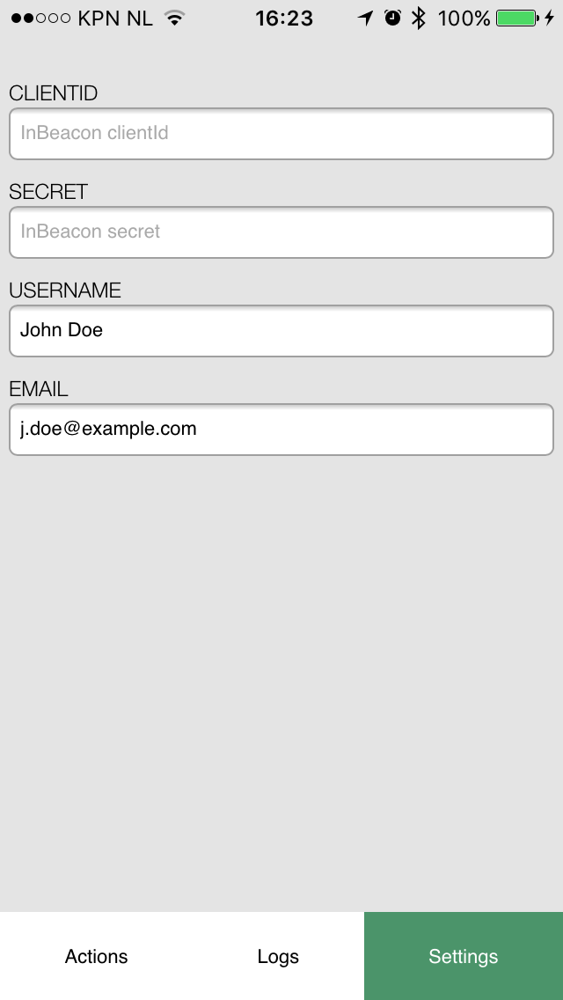

# inBeacon Cordova Plugin example app

## Prerequisites

 * nodejs >=4.2.3
 * npm >= 2.14.7
 * cordova >= 6.2.0 
 * git
 * xcode >=7
 * xcode command line tools
 * Android SDK

To check the requirements after installation use `cordova requirements`.


## Install & run on iOS

1. npm install -g cordova
2. git clone https://github.com/twogather/inbeacon-cordova-example.git
3. cd inbeacon-cordova-example
4. cordova platform add ios
5. cordova run ios --device *(a device must be attached to your mac, otherwise it starts a simulator)*

## Install & run on Android

1. npm install -g cordova
2. git clone https://github.com/twogather/inbeacon-cordova-example.git
3. cd inbeacon-cordova-example
4. cordova platform add android
5. cordova run android *(Uses attached device if available, otherwise runs on emulator)*

## Usage

To get connected with inBeacon API you'll need a working clientId and secret which you can add/edit under the settings page:



You can also edit the defaults in `www/js/index.js` at line number 21

```
var app = {

    clientId    : 'your-clientid',
    secret      : 'your-secret',
    ...
}
```

and repeat step 5 from Install & run

## Background mode (iOS)

To enable **full background mode** open it in Xcode from `platforms/ios/HelloCordova.xcodeproj` and change the *Background Modes* settings under *Capabilities*

